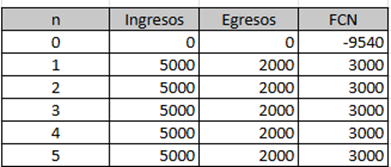

# **UNIVERSIDAD PRIVADA DE TACNA**
**FACULTAD DE INGENIERÍA** **Escuela Profesional de Ingeniería de Sistemas**

**Sistema NexusLib** **Curso:** Patrones de Software  
**Docente:** Ing. Patrick Cuadros Quiroga  

***Hurtado Ortiz, Leandro			(2015052384)***  
***Flores Navarro, Eduardo Gino		(2023076793)***  
***Cortez Mamani, Julio Samuel		(2023077283)***

---

## **CONTROL DE VERSIONES**

| Versión | Hecha por | Revisada por | Aprobada por | Fecha | Motivo |
| :---: | :--- | :--- | :--- | :--- | :--- |
| 1.0 | LDHO | LDHO | LDHO | 02/04/2025 | Versión Original |

---

# **ÍNDICE GENERAL**

1. [Descripción del proyecto](#1-descripción-del-proyecto)  
   1.1. [Nombre del proyecto](#11-nombre-del-proyecto)  
   1.2. [Duración del proyecto](#12-duración-del-proyecto)  
   1.3. [Descripción](#13-descripción)  
   1.4. [Objetivos](#14-objetivos)  
      1.4.1. [Objetivo general](#141-objetivo-general)  
      1.4.2. [Objetivos específicos](#142-objetivos-específicos)  
2. [Riesgos](#2-riesgos)  
3. [Análisis de la situación actual](#3-análisis-de-la-situación-actual)  
   3.1. [Planteamiento del problema](#31-planteamiento-del-problema)  
   3.2. [Consideraciones de hardware y software](#32-consideraciones-de-hardware-y-software)  
4. [Estudio de Factibilidad](#4-estudio-de-factibilidad)  
   4.1. [Factibilidad Técnica](#41-factibilidad-técnica)  
   4.2. [Factibilidad Económica](#42-factibilidad-económica)  
      4.2.1. [Costos de software](#421-costos-de-software)  
      4.2.2. [Costos de recursos humanos](#422-costos-de-recursos-humanos)  
      4.2.3. [Costos generales de Administración](#423-costos-generales-de-administración)  
      4.2.4. [Tabla general de costos](#424-tabla-general-de-costos)  
   4.3. [Factibilidad Operativa](#43-factibilidad-operativa)  
   4.4. [Factibilidad Legal](#44-factibilidad-legal)  
   4.5. [Factibilidad Social](#45-factibilidad-social)  
   4.6. [Factibilidad Ambiental](#46-factibilidad-ambiental)  
5. [Análisis Financiero](#5-análisis-financiero)  
   5.1. [Justificación de la Inversión](#51-justificación-de-la-inversión)  
      5.1.1. [Beneficios del proyecto](#511-beneficios-del-proyecto)  
         5.1.1.1. [Beneficios tangibles](#5111-beneficios-tangibles)  
         5.1.1.2. [Beneficios intangibles](#5112-beneficios-intangibles)  
      5.1.2. [Criterios de Inversión](#512-criterios-de-inversión)  
         5.1.2.1. [Costo inicial](#5121-costo-inicial)  
         5.1.2.2. [Costo anual de operación](#5122-costo-anual-de-operación)  
         5.1.2.3. [Tiempo de elaboración](#5123-tiempo-de-elaboración)  
         5.1.2.4. [Tasa de interés](#5124-tasa-de-interés)  
         5.1.2.5. [Relación Beneficio/Costo](#5125-relación-beneficiocosto)  
         5.1.2.6. [Valor actual neto](#5126-valor-actual-neto)  
         5.1.2.7. [Tasa Interna de Retorno (TIR)](#5127-tasa-interna-de-retorno-tir)  
6. [Conclusiones](#6-conclusiones)

---

# **Informe de Factibilidad**

# 1. Descripción del proyecto
## 1.1. Nombre del proyecto
Sistema de Buscador Unificado de Recursos para Bibliotecas Físicas y Virtuales

## 1.2. Duración del proyecto
Inicio: 25 de Marzo
Fin: 24 de junio

## 1.3. Descripción
El proyecto consiste en el diseño y desarrollo de una plataforma web integral orientada a centralizar el acceso a la información bibliográfica. El sistema permitirá a los usuarios (estudiantes y docentes) realizar búsquedas simultáneas en dos entornos: el catálogo de inventario físico (libros en estanterías) y el repositorio de recursos digitales (archivos PDF, documentos y libros electrónicos). La solución prioriza la eficiencia en la investigación académica, permitiendo conocer en tiempo real la disponibilidad de préstamos físicos y proporcionando enlaces directos de descarga o lectura para materiales virtuales. El sistema será desarrollado bajo el patrón ASP.NET MVC, utilizando SQL Server para la gestión de datos y Terraform para la provisión de infraestructura en Azure.

## 1.4. Objetivos
### 1.4.1. Objetivo general
* Desarrollar una plataforma web unificada que optimice la localización y el acceso a recursos bibliográficos físicos y digitales, mejorando la experiencia de búsqueda y la gestión de información para la comunidad académica.

### 1.4.2. Objetivos específicos
* Diseñar un sistema de búsqueda multicanal que filtre resultados por título, autor, categoría y tipo de recurso (físico o virtual).
* Implementar un módulo de gestión de inventario para controlar la disponibilidad y ubicación de los textos físicos en la biblioteca.
* Integrar un repositorio digital seguro que permita el almacenamiento y la visualización de archivos electrónicos.
* Configurar la infraestructura como código (IaC) mediante Terraform para automatizar el despliegue de los servicios en Microsoft Azure y estimar con precisión los costos operativos.
* Establecer un sistema de autenticación de usuarios que diferencie entre administradores (bibliotecarios) y usuarios finales (estudiantes/docentes).
* Garantizar la escalabilidad del sistema, permitiendo la futura integración con bases de datos de otras facultades o instituciones.

# 2. Riesgos
* **Desincronización de Inventario Físico:** Existe la posibilidad de que la base de datos no refleje en tiempo real si un libro físico ha sido tomado de la estantería sin ser registrado, lo que podría generar desconfianza en el usuario al encontrar datos inexactos.
* **Complejidad en la Integración de Recursos:** La carga de archivos digitales de gran tamaño o formatos no compatibles podría afectar los tiempos de respuesta del servidor y la experiencia de navegación del estudiante.
* **Limitación de Créditos en la Nube:** Al utilizar Azure para el despliegue final, existe el riesgo de agotar la cuota de servicios gratuitos o créditos de estudiante antes de finalizar las pruebas de rendimiento, lo que dificultará la disponibilidad operativa a largo plazo.
* **Curva de Aprendizaje en Infraestructura como Código:** El uso de Terraform para el análisis económico y despliegue requiere una configuración precisa; cualquier error en los scripts podría resultar en una estimación de costos errónea o fallos en la provisión de recursos en Azure.

# 3. Análisis de la situación actual
## 3.1. Planteamiento del problema
Si bien las instituciones académicas enfatizan constantemente la importancia del acceso a la información y la investigación de calidad, los métodos de búsqueda y localización de recursos bibliográficos pueden parecer anticuados y poco efectivos. Es necesario modernizar la forma en que se procesa el acceso a la información en las facultades y bibliotecas universitarias. Aunque los estudiantes y docentes obtienen bases teóricas para sus investigaciones, no encuentran herramientas tecnológicas integradas que les permitan localizar de manera ágil tanto el material físico como el digital en un solo lugar.

La falta de una plataforma centralizada que combine el inventario físico con el repositorio virtual limita la posibilidad de que el tiempo invertido en la búsqueda se traduzca en una investigación eficiente. Este desajuste entre la existencia del recurso y su accesibilidad genera desmotivación: los investigadores no logran visualizar la totalidad de la oferta bibliográfica de la institución en una sola interfaz, mientras que los administradores de la biblioteca carecen de un sistema unificado que vincule la gestión de estanterías con los archivos electrónicos.

## 3.2. Consideraciones de hardware y software
**Hardware:**
* **CPU:** 2 vCPU mínimo
* **Memoria RAM:** 4 GB
* **Almacenamiento:** SSD para la base de datos de libros, logs e historiales de búsqueda.

**Software:**
* **Entorno de Desarrollo:** Visual Studio 2022 con ASP.NET (.Net Framework)
* **Motor de Base de Datos:** SQL Server (Gestionado con SSMS)
* **Nube:** Azure SQL Database
* **IaC:** Terraform v1.x (para el aprovisionamiento y análisis económico).
* **Gestión de Versiones:** GitHub (Integración con Wikis, Projects y Actions).

# 4. Estudio de Factibilidad
## 4.1. Factibilidad Técnica
El proyecto resulta factible desde el punto de vista técnico, ya que el equipo de desarrollo cuenta con las competencias necesarias en ingeniería de sistemas para implementar y mantener la arquitectura propuesta bajo el patrón ASP.NET MVC. La solución utiliza tecnologías robustas y de amplio soporte, garantizando la estabilidad operativa del buscador unificado.

La viabilidad técnica se sustenta en los siguientes pilares:
* **Dominio del Stack Tecnológico:** El equipo posee experiencia en el uso de C# y el framework .NET, lo que facilita el desarrollo de una lógica de negocio eficiente para la búsqueda simultánea de recursos.
* **Gestión de Base de Datos:** Se implementará SQL Server para la administración de inventarios físicos y metadatos digitales, asegurando una integración fluida con los servicios de nube.
* **Infraestructura y automatización:** El uso de Microsoft Azure proporciona la escalabilidad necesaria para el almacenamiento de archivos electrónicos, mientras que Terraform permite gestionar dicha infraestructura mediante código, minimizando errores de configuración manual.
* **Control de Versiones y Calidad:** La integración con GitHub permite un seguimiento riguroso del avance del proyecto y facilita la implementación de pruebas de aseguramiento de calidad (QA).

La estructura modular del sistema asegura que la plataforma pueda escalar y adaptarse con facilidad, permitiendo futuras actualizaciones sin afectar la disponibilidad de los servicios bibliotecarios actuales.

## 4.2. Factibilidad Económica
Este apartado evalúa la inversión necesaria para el desarrollo y puesta en marcha del sistema, asegurando que los recursos financieros sean utilizados de manera eficiente.

### 4.2.1. Costos de software
Incluye las herramientas digitales y servicios de infraestructura en la nube proyectados. Como indica la rúbrica, los costos de Azure se basan en el análisis técnico de Terraform.

| **N°** | **Descripción** | **Precio Unitario (S/.)** | **Tiempo** | **Costo (S/.)** |
| :--- | :--- | :--- | :--- | :--- |
| 1 | Visual Studio Professional 2022 | 180 | 3 meses | 540 |
| 2 | Azure SQL Database | 120 | 3 meses | 360 |
| 3 | Azure App Service Plan | 90 | 3 meses | 270 |
| 4 | Certificado SSL / Dominio | 150 | 1 año | 150 |
| **Total** | | | | **1,320** |

### 4.2.2. Costos de recursos humanos
Contempla la inversión en horas de trabajo para el equipo de dos integrantes que cubren las áreas de Frontend y Backend.

| **N°** | **Descripción** | **Precio Unitario (S/.)** | **Horas** | **Costo (S/.)** |
| :--- | :--- | :--- | :--- | :--- |
| 1 | Desarrollo Backend | 35 | 100 | 3,500 |
| 2 | Desarrollo Frontend | 35 | 80 | 2,800 |
| 3 | Pruebas y QA | 30 | 40 | 1,200 |
| **Total** | | | | **7,500** |

### 4.2.3. Costos generales de Administración
Gastos operativos básicos necesarios para el sostenimiento del equipo durante el desarrollo.

| **N°** | **Descripción** | **Precio Unitario (S/.)** | **Meses** | **Costo (S/.)** |
| :--- | :--- | :--- | :--- | :--- |
| 1 | Servicios de Internet de alta velocidad | 120 | 3 | 360 |
| 2 | Energía Eléctrica | 70 | 3 | 210 |
| 3 | Gastos Administrativos / Oficina | 50 | 3 | 150 |
| **Total** | | | | **720** |

### 4.2.4. Tabla general de costos
Resumen consolidado de la inversión inicial requerida para el Sistema de Buscador Unificado.

| **Categoría** | **Costo (S/.)** |
| :--- | :--- |
| Costos de Software | 1,320 |
| Costos de Recursos Humanos | 7,500 |
| Costos Generales de Administración | 720 |
| **Costo Total del Proyecto** | **9,540** |

## 4.3. Factibilidad Operativa
El proyecto del Sistema de Buscador Unificado es operativamente viable, ya que su implementación se adapta al entorno académico y a las capacidades de los usuarios previstos, tanto estudiantes como bibliotecarios. La interfaz intuitiva y el enfoque centralizado facilitan su uso sin necesidad de capacitación especializada, permitiendo una transición fluida desde los métodos de búsqueda tradicionales. Además, el equipo de desarrollo ha considerado la automatización de procesos de consulta y validación de inventario, lo que permite una operación eficiente y sostenible en el tiempo. La estructura modular basada en ASP.NET MVC también posibilita la incorporación de mejoras o nuevas funcionalidades, como la integración de bases de datos externas, con mínima afectación al sistema en funcionamiento.

## 4.4. Factibilidad Legal
El desarrollo e implementación del sistema se encuentra estrictamente dentro del marco legal vigente. La plataforma no infringe derechos de propiedad intelectual, ya que emplea tecnologías de libre uso o con licencias adecuadas, como el motor SQL Server y el entorno de .NET Core. Además, el tratamiento de los datos personales de los usuarios (como registros de préstamos y perfiles de estudiantes) se gestionará de acuerdo con la Ley N.° 29733 – Ley de Protección de Datos Personales en el Perú. Para garantizar la legalidad y seguridad del proyecto, se implementarán mecanismos de cifrado de contraseñas y avisos de privacidad para los usuarios registrados, cumpliendo con los estándares de seguridad exigidos por la facultad.

## 4.5. Factibilidad Social
El proyecto demuestra una elevada viabilidad social, ya que atiende una demanda académica crítica: optimizar el acceso al conocimiento y fomentar la investigación científica mediante herramientas digitales modernas. Su diseño considera la inclusión y facilidad de uso para investigadores de diferentes niveles, eliminando las barreras tecnológicas que suelen segmentar la información física de la virtual. Al unificar estos recursos, se promueve una cultura de investigación más dinámica y eficiente, reforzando valores como la democratización de la información y el trabajo intelectual en comunidad. Su puesta en marcha influirá positivamente en los hábitos de estudio y en la excelencia académica de la institución.

## 4.6. Factibilidad Ambiental
El sistema es ambientalmente factible, ya que su implementación promueve prácticas sostenibles que reducen el impacto ecológico de la gestión administrativa. Al centralizar la consulta en una plataforma digital y permitir el acceso directo a recursos virtuales, se reduce drásticamente la necesidad de materiales impresos, fotocopias y el uso excesivo de papel. Además, el uso de infraestructura en la nube (Azure) optimiza el consumo energético al evitar el mantenimiento de servidores físicos locales que requieren refrigeración constante. Por lo tanto, el proyecto no solo es respetuoso con el medio ambiente, sino que también impulsa un cambio positivo hacia la digitalización sostenible de los recursos educativos.

# 5. Análisis Financiero
## 5.1. Justificación de la Inversión
La contribución al desarrollo de una plataforma unificada para identificar y monitorear el acceso a recursos bibliográficos físicos y virtuales responde a la creciente necesidad de modernizar la infraestructura de investigación académica. Al proporcionar recursos financieros a esta iniciativa, se busca reemplazar los métodos tradicionales de búsqueda manual y catálogos fragmentados que no fomentan experiencias interactivas que integren la teoría y la práctica en un solo entorno digital. Esto facilitará la adopción de hábitos de investigación eficientes para estudiantes y docentes, de acuerdo con los objetivos estratégicos de transformación digital para la educación superior. Además, la integración de la infraestructura como código mediante Terraform añade un valor significativo al proyecto, potenciando la transparencia en el gasto de nube y mejorando el rendimiento técnico y social de la inversión inicial.

### 5.1.1. Beneficios del proyecto
#### 5.1.1.1. Beneficios tangibles
* **Reducción de costos operativos:** La plataforma digital permite disminuir los gastos en materiales de oficina y fotocopias al integrar el monitoreo y la consulta de recursos en un entorno virtual centralizado.
* **Optimización de recursos físicos:** Las operaciones de búsqueda y gestión automatizadas eliminan la necesidad de catálogos impresos, reduciendo el consumo de papel y otros insumos administrativos de la biblioteca.
* **Ahorro en infraestructura TI:** Al implementar una solución en la nube con Azure y Terraform, la institución evita grandes inversiones iniciales en servidores físicos locales, pagando únicamente por los recursos computacionales que realmente utiliza.
* **Eficiencia en la gestión del tiempo:** La automatización de la disponibilidad de libros y acceso a PDFs libera la carga administrativa del personal bibliotecario, permitiendo una mejor distribución del talento humano en tareas de asesoría académica.

#### 5.1.1.2. Beneficios intangibles
* **Incremento en la motivación académica:** El diseño centralizado y moderno de la aplicación potencia la motivación intrínseca de los estudiantes, favoreciendo una investigación más fluida que se refleja en la calidad de sus trabajos académicos.
* **Desarrollo de competencias digitales:** Gracias a esta herramienta, tanto docentes como estudiantes mejoran sus habilidades en el manejo de repositorios digitales y entornos de búsqueda avanzada.
* **Fortalecimiento de la imagen institucional:** La implementación de esta solución de vanguardia refuerza el compromiso de la universidad con la innovación tecnológica y la responsabilidad educativa, mejorando su percepción ante la comunidad y otras entidades.
* **Fomento de una cultura de investigación:** El programa promueve un acceso democrático a la información, generando un impacto positivo en la conciencia colectiva sobre la importancia de utilizar recursos bibliográficos validados y actualizados.

### 5.1.2. Criterios de Inversión
#### 5.1.2.1. Costo inicial
El costo inicial comprende todas las inversiones requeridas para poner en marcha el Sistema de Buscador Unificado antes de que se empiecen a generar valor o beneficios académicos. En el análisis financiero, la totalidad de la inversión, que asciende a S/ 9,540, se registra en el año 0 de la tabla de Flujo de Caja Neto (FCN), lo que implica que dicho desembolso aparece como un flujo de salida inmediato. Este gasto es fundamental, ya que establece la base tecnológica (infraestructura en Azure y desarrollo de software) sobre la cual se recuperará la inversión a través de la optimización de procesos y ahorros proyectados.

#### 5.1.2.2. Costo anual de operación
En la tabla de Flujos de Caja Neto (FCN), los costos se presentan de manera anual durante los primeros cinco años y se descuentan de los beneficios proyectados para calcular el FCN correspondiente a cada período. Desde un punto de vista analítico, estos costos operativos disminuyen los flujos netos anuales, lo que afecta directamente el cálculo del VAN y la relación beneficio/costo. Un nivel de operación excesivamente alto puede poner en riesgo la rentabilidad del proyecto, mientras que una gestión austera contribuye a tener indicadores financieros más sólidos.

#### 5.1.2.3. Tiempo de elaboración
El tiempo de elaboración es el lapso que transcurre desde el inicio del proyecto hasta que la plataforma unificada está lista para su fase piloto o atención a los primeros usuarios. El proyecto tiene un tiempo estimado de 3 meses para la completa elaboración, pruebas de integración de recursos físicos/digitales y puesta en marcha final del sistema.

#### 5.1.2.4. Tasa de interés
La tasa de interés utilizada en el análisis financiero actúa como una tasa de descuento o como el costo de oportunidad del capital invertido. Esta tasa representa el rendimiento mínimo esperado de un proyecto con un perfil de riesgo similar. En nuestro prototipo, hemos establecido esta tasa en un 3% anual, lo que refleja un costo de oportunidad moderado y pone énfasis en el impacto social y educativo de la biblioteca, priorizando el valor académico sobre la presión financiera inmediata.

**Inversión:** S/. 9,540
**Tasa de interés:** 3%

#### 5.1.2.5. Relación Beneficio/Costo
| B/C | 1.44 |
| :--- | :--- |

*Al ser mayor a 1, el indicador confirma que los beneficios proyectados superan la inversión y los costos operativos. Esto significa que por cada sol invertido, el sistema genera un retorno de 1.44 soles en valor presente.*

#### 5.1.2.6. Valor actual neto
| VAN | 4,199.12 |
| :--- | :--- |

*Este valor representa la ganancia neta del proyecto tras recuperar la inversión inicial y cubrir todos los egresos descontados a cinco años. Un VAN positivo asegura que el sistema es financieramente viable y genera valor para la institución.*

#### 5.1.2.7. Tasa Interna de Retorno (TIR)
| TIR | 17% |
| :--- | :--- |

*La TIR del 17% demuestra que la rentabilidad propia del proyecto es significativamente superior a la tasa de descuento del 3% propuesta. Esto garantiza que el buscador unificado es una inversión sólida y resistente a variaciones de costos en la nube.*

# 6. Conclusiones
* El proyecto del Sistema de Buscador Unificado demuestra ser factible en todos los aspectos evaluados: técnico, económico, operativo, legal, social y ambiental.
* La propuesta tecnológica basada en ASP.NET MVC, SQL Server e infraestructura en Azure garantiza una solución robusta y escalable para la gestión de recursos bibliográficos.
* El análisis financiero respalda la inversión con indicadores positivos, destacando un VAN de S/ 4,199.12 y una relación Beneficio/Costo de 1.44, lo que asegura la rentabilidad del sistema.
* La implementación de Terraform para el análisis económico permite una gestión precisa de los costos en la nube, optimizando los recursos institucionales y cumpliendo con los estándares de automatización exigidos.
* El sistema representa una oportunidad real de modernización académica, permitiendo a estudiantes y docentes acceder de manera eficiente a la totalidad de la oferta bibliográfica de la institución.
* En conjunto, el proyecto se presenta como una solución sólida con un alto impacto social y educativo, alineado con las metas de transformación digital de la facultad.
